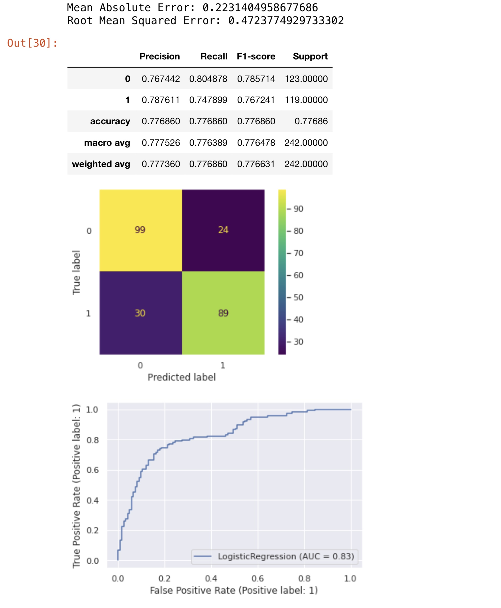
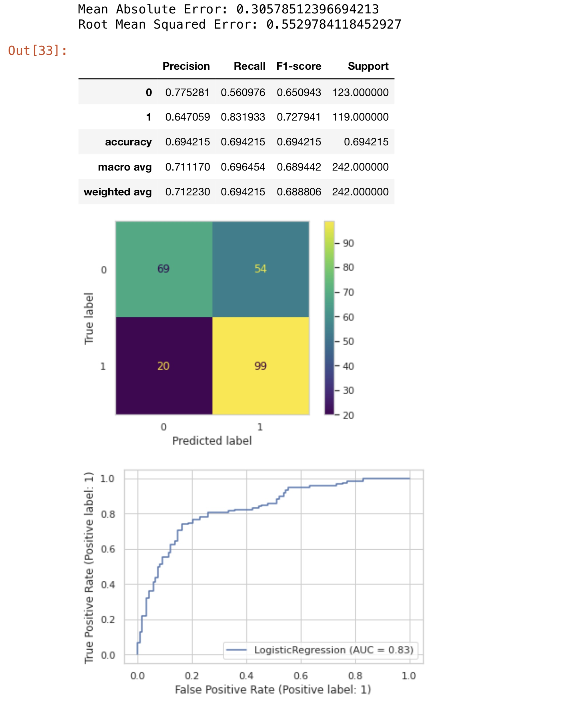
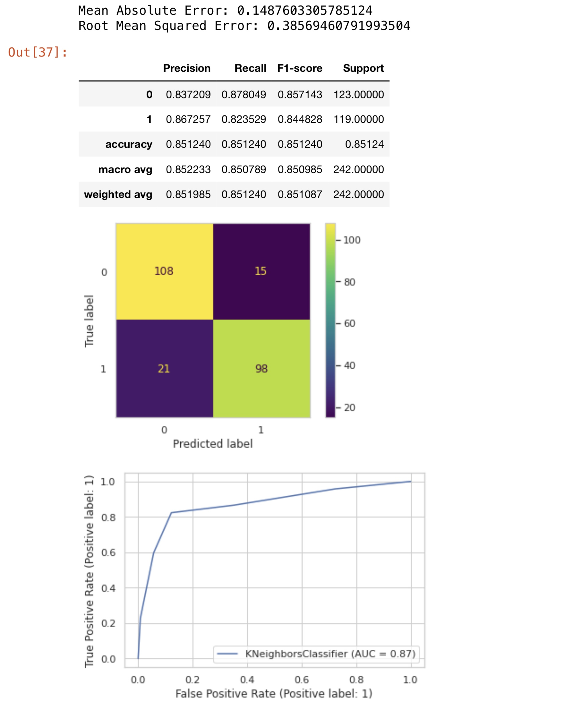
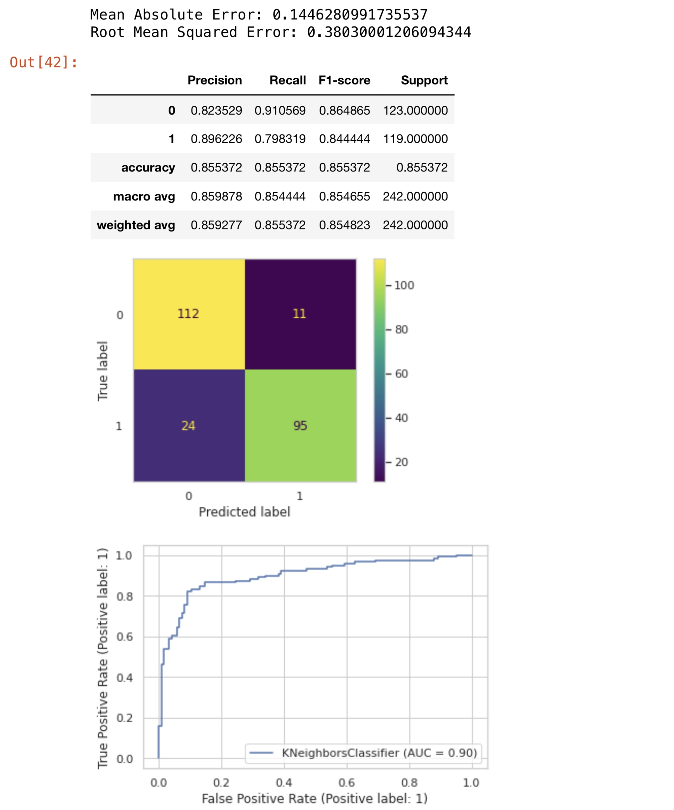
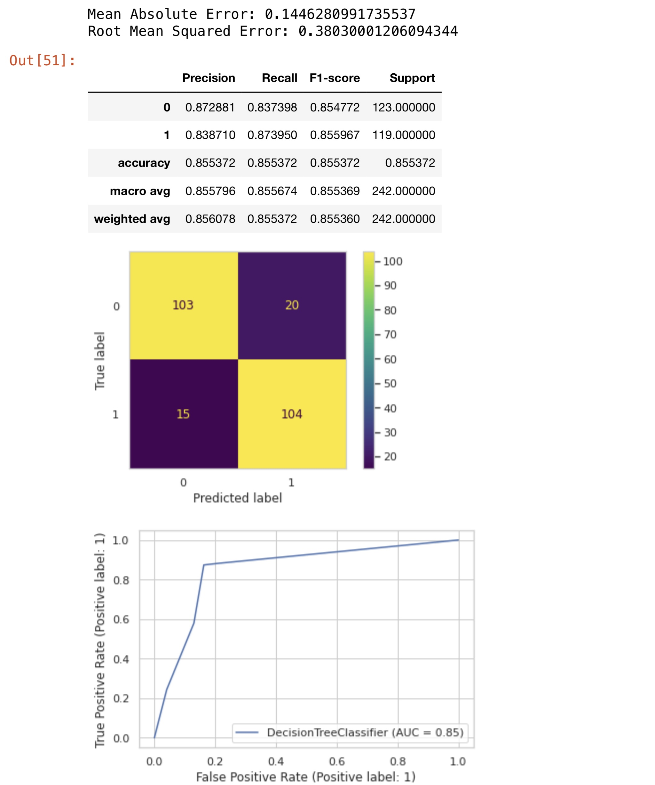
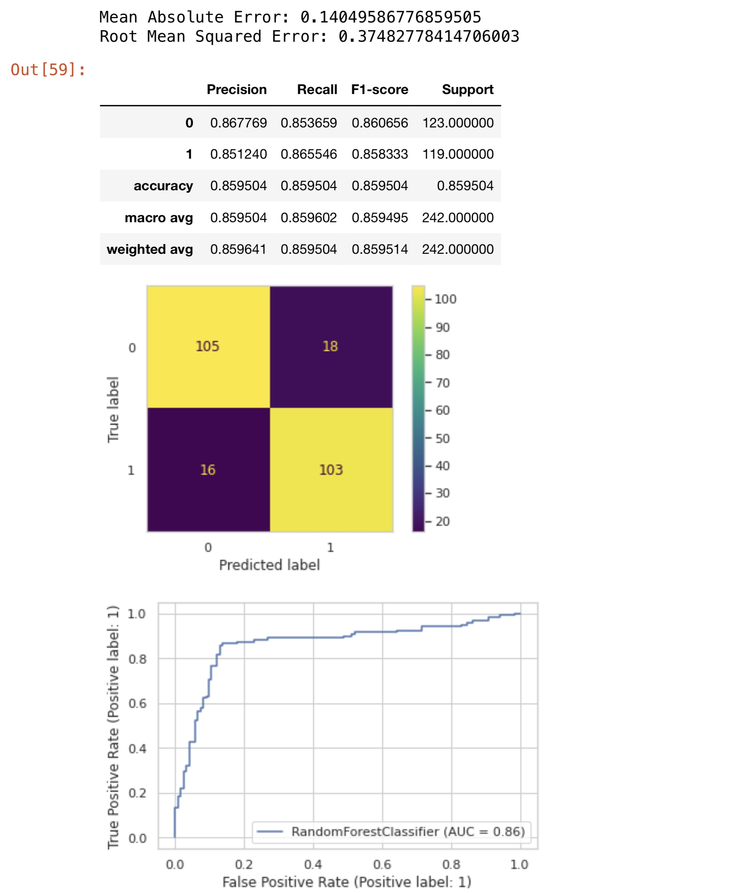
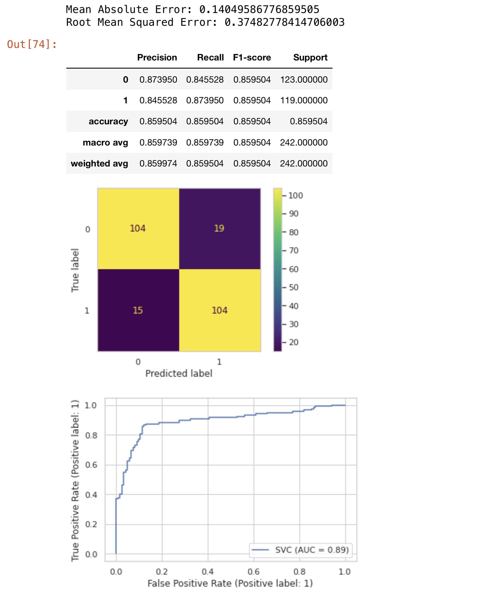
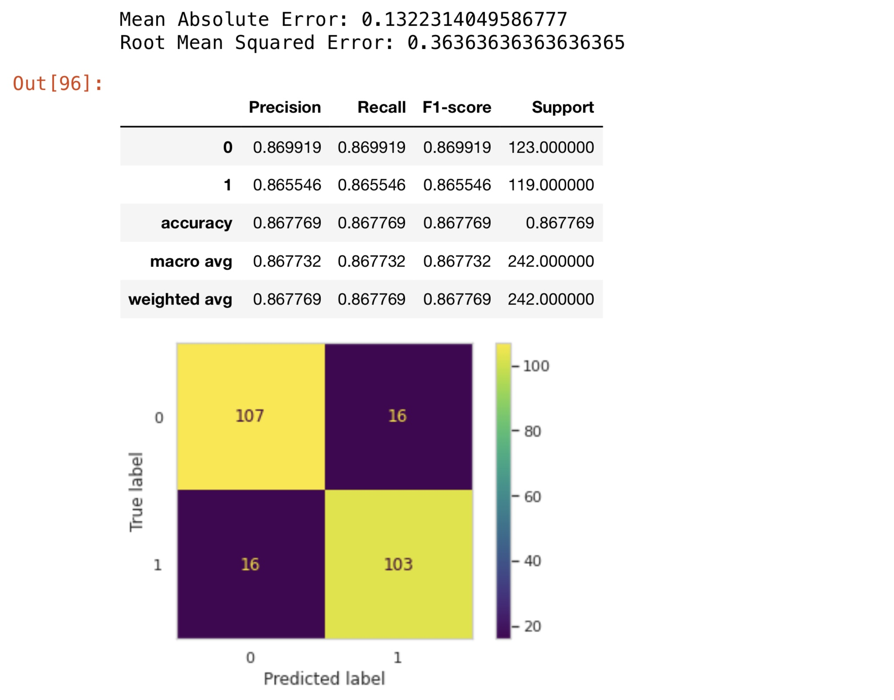

# SyriaTel Customer Churn
Author: Pharoah Evelyn


## Overview
#### The goal of this notebook is to predict when a customer will stop continuing their service with SyriaTel.
We will discover which features we can use to predict what will determine if a customer stops their cell phone service or not.

We accomplish this by approaching it as a classification problem and employing various machine learning algorithms to provide insights.


## Business Problem
SyriaTel is a Mobile Network Provider currently researching how to improve its services.

SyriaTel wants to know the answer to why customers may stop doing business with them.


## Data Preparation
We are using a dataset which displays customer churn within SyriaTel. 
* The data file is in this GitHub Repository as `bigml_59c28831336c6604c800002a.csv`

Once the data was imported, EDA was performed to ensure that this data was usable before employing the functions we needed to solve our business problem.

We needed to convert the churn series into an int to work with the classification.

The data, in this case, was largely unbalanced, with positive customer churn by far being in the minority.

We used undersampling to have our data be fair, which dramatically enhances our models' ability to make accurate predictions.


## Methods Used

Once the data was processed, we ran it through various ML algorithms.

Each algorithm was with vanilla parameters and again using tuned parameters.

GridsearchCV was used to perform exhaustive searches to find the best classification models.

Each run was also configured to return a confusion matrix, a classification report, error scores, a ROC curve, and feature importances (all where applicable.)

We generally want to select a model that best makes fewer False Negative predictions. Thus, a higher Recall Score is preferred.

Below are the results!


## Models

#### Vanilla Logistic Regression

Interpretation of churn with a vanilla LR Model:
* 99 True Negatives: Customers continue service with SyriaTel
* 24 False Positives: The model believes customers will continue service with SyriaTel, but they do not
* 30 False Negatives: The model believes customers will not continue service with SyriaTel, but they do
* 89 True Positives: Customers do not continue service with SyriaTel

#### Tuned Logistic Regression

Interpretation of churn with a tuned LR Model:
* 69 True Negatives: Customers continue service with SyriaTel
* 54 False Positives: The model believes customers will continue service with SyriaTel, but they do not
* 20 False Negatives: The model believes customers will not continue service with SyriaTel, but they do
* 99 True Positives: Customers do not continue service with SyriaTel

#### Vanilla KNN

Interpretation of churn with a vanilla KNN Model:
* 108 True Negatives: Customers continue service with SyriaTel
* 15 False Positives: The model believes customers will continue service with SyriaTel, but they do not
* 22 False Negatives: The model believes customers  will not continue service with SyriaTel, but they do 
* 98 True Positives: Customers do not continue service with SyriaTel

#### Tuned KNN

Interpretation of churn with a tuned KNN Model:
* 112 True Negatives: Customers continue service with SyriaTel
* 11 False Positives: The model believes customers will continue service with SyriaTel, but they do not
* 24 False Negatives: The model believes customers  will not continue service with SyriaTel, but they do 
* 95 True Positives: Customers do not continue service with SyriaTel

#### Vanilla Decision Tree

Interpretation of churn with a vanilla Decision Tree:
* 97 True Negatives: Customers continue service with SyriaTel
* 26 False Positives: The model believes customers will continue service with SyriaTel, but they do not
* 23 False Negatives: The model believes customers  will not continue service with SyriaTel, but they do 
* 96 True Positives: Customers do not continue service with SyriaTel

#### Tuned Decision Tree

Interpretation of churn with Tuned Decision Tree:
* 103 True Negatives: Customers continue service with SyriaTel
* 20 False Positives: The model believes customers will continue service with SyriaTel, but they do not
* 15 False Negatives: The model believes customers  will not continue service with SyriaTel, but they do 
* 104 True Positives: Customers do not continue service with SyriaTel

#### Vanilla Forest

Interpretation of churn with a Vanilla Forest:
* 105 True Negatives: Customers continue service with SyriaTel
* 18 False Positives: The model believes customers will continue service with SyriaTel, but they do not
* 16 False Negatives: The model believes customers  will not continue service with SyriaTel, but they do 
* 103 True Positives: Customers do not continue service with SyriaTel

#### Tuned Forest

Interpretation of churn with a Tuned Forest:
* 105 True Negatives: Customers continue service with SyriaTel
* 18 False Positives: The model believes customers will continue service with SyriaTel, but they do not
* 16 False Negatives: The model believes customers  will not continue service with SyriaTel, but they do 
* 103 True Positives: Customers do not continue service with SyriaTel

#### Vanilla SVM

Interpretation of churn with a Vanilla SVM:
* 104 True Negatives: Customers continue service with SyriaTel
* 19 False Positives: The model believes customers will continue service with SyriaTel, but they do not
* 15 False Negatives: The model believes customers  will not continue service with SyriaTel, but they do 
* 104 True Positives: Customers do not continue service with SyriaTel

#### Tuned SVM

Interpretation of churn with a Tuned SVM:
* 105 True Negatives: Customers continue service with SyriaTel
* 18 False Positives: The model believes customers will continue service with SyriaTel, but they do not
* 15 False Negatives: The model believes customers  will not continue service with SyriaTel, but they do 
* 104 True Positives: Customers do not continue service with SyriaTel

#### AdaBoost

Interpretation of churn with Adaboost:
* 96 True Negatives: Customers continue service with SyriaTel
* 27 False Positives: The model believes customers will continue service with SyriaTel, but they do not
* 25 False Negatives: The model believes customers  will not continue service with SyriaTel, but they do 
* 94 True Positives: Customers do not continue service with SyriaTel

#### GradientBoost

Interpretation of churn with GradientBoost:
* 103 True Negatives: Customers continue service with SyriaTel
* 20 False Positives: The model believes customers will continue service with SyriaTel, but they do not
* 20 False Negatives: The model believes customers  will not continue service with SyriaTel, but they do 
* 99 True Positives: Customers do not continue service with SyriaTel

#### VotingClassifier

Interpretation of churn with an average `VotingClassifier`:
* 107 True Negatives: Customers continue service with SyriaTel
* 16 False Positives: The model believes customers will continue service with SyriaTel, but they do not
* 16 False Negatives: The model believes customers  will not continue service with SyriaTel, but they do 
* 103 True Positives: Customers do not continue service with SyriaTel


## Conclusions
Overall, most models perform similarly, but only one must be selected.

#### The best model turns out to be the Tuned SVM algorithm.

This is because it: 
* Consistently has among the highest Precision, Recall, & F1 scores
* Has excellent MAE & RMSE scores.
* Posesses solid ROC curve, with an AUC of 0.89
* Recieved the lowest number of reported False Positive/Negatives on the confusion matrix

Features: `number vmail messages`, `total day minutes`, `total day calls`, `total eve calls`, `total night calls`, `total intl minutes`, `total intl calls`, `customer service calls`, `international plan_yes`, `voice mail plan_yes`

#### Most important features determining customer churn: `total day minutes`, `customer service calls`, `international plan_yes`
Based on all feature_importances plots


## Recommendations
#### Usage for our model:
* This model is best for predicting whether or not a customer will renew their service with SyriaTel, using the features listed above.
* SyriaTel can use this model to help determine ways to retain more customers, including altering their phone plan to accommodate highly viable services for maintaining users.
* This model will not help predict the locations of where a user might live or what the area code of their phone number might be (regardless of churn.)

#### Suggestions:
Based on these findings, SyriaTel can benefit:
* Offering customers better deals on cell phone minutes & international phone plans.
* Refine the Customer Service experience, so customers are more satisfied.

SyriaTel can modify this model by:
* Tuning the parameters on the grid search on the this model
* Include fewer features for the model to process
* Use all features from the original dataframe for modeling and see if the Precision, Recall, & F1-scores change.


## Next Steps
* Employ a marketing campaign that highlights adjustments to phone plans.
* Ensure existing users directly benefit from any changes made; this way, the current userbase maintains its satisfaction.
  * Existing users will also voice their satisfaction to people. Which will help with ad campaigns.


## Repository Structure
A description of the structure of this repository and its contents:
```
└── images                              <- Both sourced externally and generated from code
├── data                                <- Sourced externally from code
├── Predicting_SyriaTel_Customer_Churn.ipynb   
    ^^ Narrative documentation of analysis in Jupyter notebook
├── Predicting_SyriaTel_Customer_Churn.pdf       <- PDF version of project presentation
├── README.md                           <- The top-level README for reviewers of this project

```